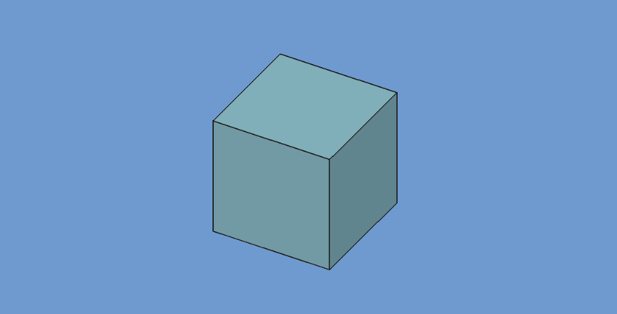

# Minimal

Addon example that's easy to make your own.

 
 

>   [!IMPORTANT]  
>   All files in this repository are examples for this fictional addon.  
>   → The `CONTRIBUTING.md` file is for the addon, not this template!

 

## Details

[» Read about the details of this template][Wiki]

[Wiki]: https://github.com/FreeCAD/Addon-Template/wiki
